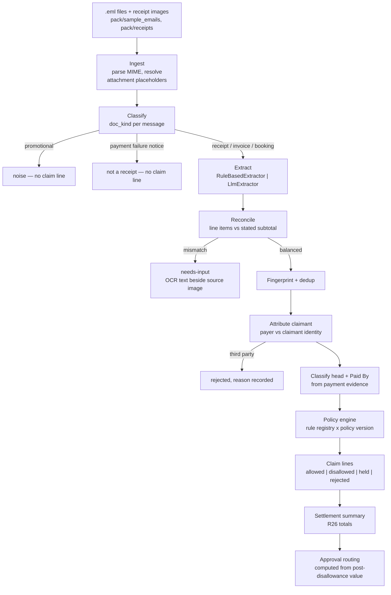
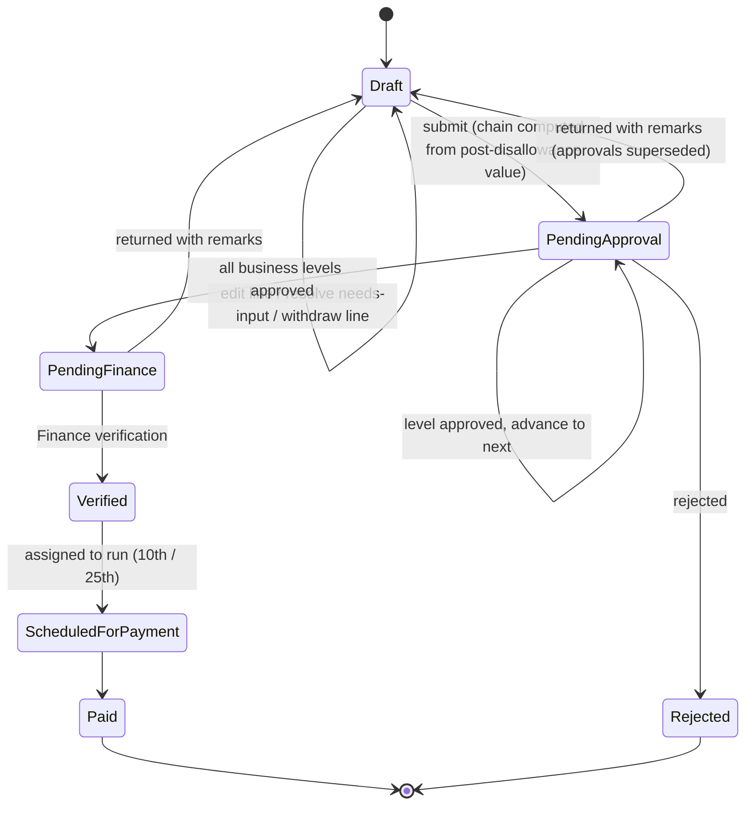

# feat: Travel Expense Reimbursement System (Nortex)

## Overview

Build a working travel expense reimbursement application for Nortex Industries: an employee's scattered inbox becomes a policy-checked, correctly-routed settlement claim with visible status, replacing 25–30 minutes of manual transcription and the error class that comes with it.

Greenfield. FastAPI backend + Next.js/TypeScript frontend, following the conventions already in use at `ceew/cr-atlas/cr-atlas-api`, with three deliberate departures noted below.

The system's correctness story is a single acceptance test that reproduces the anchor trip from `pack/` and asserts every one of the thirteen traps the pack deliberately plants.

## Problem Frame

An employee returning from a work trip transcribes a blank Travel Expense Settlement Form by hand from an inbox containing an approval thread, an advance confirmation, travel-desk bookings, cab receipts, a photographed restaurant bill and a hotel tax invoice. The transcription is slow and it is where the errors originate — personal items left on the folio, duplicate receipts, a colleague's cab, an entertainment bill filed as a meal. The claim then climbs an approval chain and disappears into Finance for two weeks.

Three costs to remove: the 25 minutes, the errors, the follow-ups (see origin: `docs/brainstorms/2026-09-11-travel-expense-settlement-requirements.md`).

Affected parties: travelling employees, four levels of approver, and Finance Shared Services. The approval chain is amount-dependent, so a change in the claim total changes who must act — the roles are coupled, not independent.

Anchor case: Chaitanya Reddy (NX-4471), Pune → Bengaluru, 16–20 Jun 2026. Fifteen messages, two image receipts.

## Requirements Trace

Carried from the origin document. The full R1–R36 list lives there; this plan maps them to units rather than restating them.

| Group | Requirements | Units |
|---|---|---|
| Trip lifecycle, Travel Request ID as join key | R1–R4 | 2, 7 |
| Evidence ingestion, classification, dedup, OCR, review, confidence | R5–R11 | 3, 4, 5 |
| Policy evaluation, decomposition, tax, caps, classification, rejection | R12–R28 | 5, 6 |
| Approvals, routing, return-and-resubmit, status, deadlines, audit, export | R29–R36 | 7, 8, 9 |

Success criteria are reproduced verbatim as assertions in `backend/tests/test_acceptance_nortex_trip.py` (Unit 9). That test file is the requirements trace in executable form.

## Scope Boundaries

Carried unchanged from the origin document:

- Evidence arrives as files from `pack/`. No live mailbox, IMAP, or OAuth mail sync.
- No real authentication. A user switcher stands in for login across employee, approver and Finance roles.
- No payment integration. Payment release is a recorded state and a run date.
- Domestic INR only. No FX, no international-travel approval branch (the MD/CEO level exists in the data model and matrix but is not the demonstrated path).
- No travel booking. The travel desk stays outside the system.
- Single organisation, single policy document. Policy is versioned data, edited as data — no policy authoring UI.
- Responsive web only, no mobile app.
- No notification delivery. Status is pulled, not pushed.

Added at planning time:

- `pack/` is read-only input and is never written to.
- No multi-tenant concerns, no RBAC beyond the role field already in `employee_master.csv`.

## Context & Research

### Relevant Code and Patterns

There is no prior code in this project. Conventions are inherited from `/home/hayagreev/ceew/cr-atlas/cr-atlas-api`, which contains both the FastAPI backend and a Next.js 15 frontend.

**Backend patterns to follow:**

- `cr-atlas-api/pyproject.toml` — flat single manifest, `~=` compatible-release pins, PEP 735 `[dependency-groups]` for dev deps, inline comments justifying non-obvious pins. uv with a committed lockfile.
- `cr-atlas-api/main.py` (~lines 289–320) — domain packages each export a bare `APIRouter` with no prefix or tags set in the module; prefixes are applied once at include time so the URL map is readable in one place. Path-versioned under `/api/v1/`.
- `cr-atlas-api/apps/api/auth/schemas.py` — `<Verb><Noun>Request` / `<Verb><Noun>Response` naming, one model per direction, never a shared input/output model. `Literal[...]` for constrained values, `Field(max_length=...)` on any client-controlled string.
- `cr-atlas-api/apps/api/activity/router.py` — the documented rationale for choosing `Literal` over free text at the API boundary while keeping the column permissive.
- `cr-atlas-api/apps/api/ai_clim_data_agent/request_models.py` — `@field_serializer` emitting explicit UTC `Z`, with a comment recording that naive datetimes were being reparsed in the browser's local timezone. Directly relevant to the status timeline.
- `cr-atlas-api/apps/api/db.py` (~line 983) — async engine and `async_sessionmaker` construction, `session: AsyncSession = Depends(get_async_session)` as the last parameter. Every pool kwarg carries a comment naming the default it overrides.
- `cr-atlas-api/apps/api/handlers/handlers.py` — three global exception handlers. 5xx logged at ERROR with the body replaced by generic copy; 4xx logged at WARNING with `detail` passed through; `RequestValidationError` stripped to `{loc, msg}` because Pydantic v2's `input` field echoes the raw submitted value; a catch-all `Exception` handler so no traceback leaks.
- `cr-atlas-api/config/settings.py` — one `Settings(BaseSettings)` singleton instantiated at module scope. Required fields carry no default so a missing `.env` is a boot crash. Derived values as `@property`. Feature flags typed `Literal[...]` so a typo fails at boot.
- `cr-atlas-api/alembic.ini` — `sqlalchemy.url` commented out and set programmatically in `env.py`; a `post_write_hooks` block running `ruff check --fix` on every generated revision. Migrations never run in the app lifespan.
- `cr-atlas-api/tests/conftest.py` and `docs/agents/testing.md` — the mocked-vs-database split, `join_transaction_mode="create_savepoint"` rollback isolation, the `_test` DB-name suffix guard, and the autouse fixture that refuses connections on the application engine.
- `cr-atlas-api/tests/db_helpers.py` — plain async row-builder functions taking `session` plus keyword-only args, in place of a factory library.
- `cr-atlas-api/scripts/test-db.sh` + `docker-compose.test.yml` — a small POSIX `sh` script with an `up|down|url|test` case statement handing local and CI the same `TEST_DATABASE_URL`, so conftest has one code path.

**Frontend patterns to follow:**

- `cr-atlas-api/ui/src/features/<feature>/{api,components,hooks,store,types}` — feature-first colocation. Maps directly onto trips, evidence, claim-review, approvals, finance.
- `cr-atlas-api/ui/src/api/error.ts` — `ApiError extends Error` carrying `status`, a `category` enum, `userMessage`, `detail` and `raw`; a `DEFAULT_MESSAGES` map; a `fromResponse()` that parses all three FastAPI `detail` shapes (string, Pydantic array, structured `{code, message}`). The stated rule that `userMessage` is safe to render and `detail`/`status` are for logging only, with `Error.message` set to the safe copy so a careless render is still safe. Lift nearly verbatim.
- `cr-atlas-api/ui/src/api/client.ts` — leaf-module discipline: only call the 401 notifier from the `!response.ok` branch, never a top-level catch, so network failures and aborts do not sign a user out. The module never imports from auth, context or hooks.
- `cr-atlas-api/ui/src/app/global_config.ts` — a single exported `baseUrl` constant rather than scattered `process.env` reads.
- `cr-atlas-api/ui/src/app/providers.tsx` — `QueryClient` created at module scope and exported so role switching can evict per-user cache; `retry` configured to refuse any HTTP 4xx.
- `cr-atlas-api/main.py` (~line 330) and `config/settings.py` — the CORS incident. `allow_origins=["*"]` makes Starlette answer a bare `Access-Control-Allow-Origin: *`, which browsers reject for `credentials: "include"`; every first-time sign-in failed as an opaque network error with a 200 and a valid `Set-Cookie` visible in DevTools. Use `allow_origin_regex` anchored at both ends. Separately, `expose_headers` must be an explicit list — a wildcard is ignored on credentialed requests.
- Middleware ordering: `add_middleware` prepends, so a body-guard middleware must be added *before* `CORSMiddleware` for its 413/429 responses to carry CORS headers. Relevant to the evidence upload endpoint.

**Documentation shape to follow:** `AGENTS.md` as the canonical document, a four-line `CLAUDE.md` that only points at it, and `docs/agents/<area>.md` deep-dives indexed from `AGENTS.md`.

### Institutional Learnings

`docs/solutions/` does not exist in this project. The equivalent institutional knowledge for this work is the cr-atlas convention set above, particularly the CORS incident, the 422-sanitisation rule, and the testing split.

### Planning-Time Findings

Two findings from direct inspection of `pack/` materially shape the plan.

**Finding 1 — the `.eml` attachments are placeholders, not base64.** Messages 11 and 12 declare `Content-Type: multipart/mixed` with `Content-Transfer-Encoding: base64`, but the part body is the literal text `[ATTACHMENT: see receipts/dinner_bill_18jun.png in this pack]`. A standard MIME parser will produce a part with no decodable image. The ingester must detect this placeholder form and resolve the named file against `pack/receipts/`. Without this, attachment handling silently yields nothing and both image receipts vanish from the claim.

**Finding 2 — OCR loses a line on the hotel folio, and the loss is silent.** Running `tesseract --psm 6` against `pack/receipts/hotel_invoice_1188.png` returns:

```
16-Jun Room Charge          5,750.00
Spodun—Reom—Cheange.        5.750.00
17-Jun Laundry                450.00
```

Both images have a fold drawn across them, and on the hotel invoice the fold sits on the second room-charge line. The label is destroyed and the amount degrades from `5,750.00` to `5.750.00`. Card digits split on both images (`****22 88`, `****2 288`), and the dinner bill picks up a garbage line where its fold crosses.

The consequence is the important part: line items extracted from that folio sum to **13,450**, not the stated **19,200** subtotal, and nothing about the failure is loud. A naive pipeline understates the claim by 3,750 and reports success.

The answer is not better OCR. It is a **reconciliation guard** — extracted line items must sum to the bill's own stated subtotal, and any mismatch becomes a needs-input flag showing OCR text beside the source image for human correction. This guard is extractor-agnostic, so it protects the LLM adapter too. It is treated as trap 13 and gets its own acceptance assertion.

Amount parsing must also treat `5.750.00` correctly: where more than one separator is present, all but the last are thousands separators. That recovers the value even though the label stays unreadable, so the line surfaces as an uncategorised 5,750 needing classification rather than as a missing 5,750.

**Environment facts:** Python 3.12.3 and 3.13 available, node 20.19.5, npm 11.6.4, uv 0.9.10, Docker 29.1.0, tesseract 5.3.4 installed. No `ANTHROPIC_API_KEY`, no `ant` CLI, no OAuth profile — a model-based extractor cannot be exercised in this environment, which is why it is a documented seam rather than the shipped path.

### External References

- Policy source of truth: `pack/expense_policy.md` (NTX-HR-POL-11, Rev 4, effective 01 Apr 2026).
- Form structure and legends: `pack/Travel_Expense_Forms_Template.xlsx`, sheets `Travel Request Form` and `Expense Settlement Form`. The legend rows are normative — notably legend line 63 (`Paid By` must be exactly `Employee` or `Company` because the summary uses `SUMIF` on that word), line 65 (proof refs must name a document), line 66 (disallowed items go on the disallowed row with a remark, never silently dropped) and line 67 (payable and recoverable are mutually exclusive).
- If the optional LLM adapter is built: model ID `claude-opus-5`, structured output via `output_config: {format: {...}}` (not the deprecated `output_format`), images passed as `image` content blocks. Do not use `budget_tokens`.

## Key Technical Decisions

**Stack: FastAPI backend + Next.js 15 frontend as sibling directories.** User-selected. Departure from cr-atlas: the frontend is a sibling `frontend/`, not nested inside the backend repo as `ui/`. Nothing ties them at the tooling level in cr-atlas either, and nesting only makes paths awkward.

**SQLite, one file owned by this application — revised during Unit 1.** Originally planned as Postgres 17 in Docker Compose. Changed on the user's explicit instruction that this application must not share a database with any CEEW project. The first Compose attempt bound Postgres to port 55432, which is the port `cr-atlas-api`'s test database already uses; the container failed to start on the port clash. No CEEW database was read or written, but the collision made the coupling risk concrete, and a port-level near-miss is a bad property for a system that handles money.

SQLite removes the class of problem rather than dodging it: no port, no server, no shared instance, nothing to provision in CI, and no way to point at the wrong database by accident. It also improves the deliverable — `make dev` needs no container at all, and the database-half tests can never silently skip for want of a service.

Two costs, accepted knowingly:
- **Portable column types only.** `sa.JSON` rather than `JSONB`, Python-side UUID defaults, no advisory locks. The policy payload and audit trail are both fine as `sa.JSON`; neither needs JSONB operators.
- **SQLite serialises writers.** The concurrent-approver test then proves the application's own version check holds under contention, but exercises coarser locking than Postgres would. This is a stated limitation in `docs/agents/testing.md` and in the note, not a silently weaker test.

**Proper Python packaging: `backend/src/expense_api/` with a real `[build-system]` and `app = create_app()`.** Deliberate departure from cr-atlas, which puts `main.py` at the repo root with no build system and compensates with `sys.path.insert` in conftest. Greenfield has no reason to inherit that.

**Split persistence modules: `db/models.py`, `db/database.py`, per-domain `schemas.py`.** Deliberate departure from cr-atlas's 87 KB `apps/api/db.py`, which mixes ORM models, engine, session dependency and Pydantic DTOs. That is acknowledged technical debt there.

**Real Alembic baseline, plain `op.*` calls.** cr-atlas's baseline is `Base.metadata.create_all()` of the then-current ORM, which forces every later revision through existence-checked helpers in `migration_ddl.py`. That apparatus exists to compensate for a broken baseline and must not be replicated. Keep the two good parts: URL set programmatically in `env.py`, and the `ruff check --fix` post-write hook.

**Pydantic v2 `model_config = ConfigDict(...)` / `SettingsConfigDict(...)`, not `class Config`.** cr-atlas still uses the v1-style inner class, which works but is deprecated.

**Add a type checker.** cr-atlas runs ruff only and has no mypy or pyright anywhere despite being thoroughly annotated. Add mypy in strict mode over `expense_api` to pre-commit and CI. Cheap, and a policy engine is exactly the code where it pays.

**Generate TypeScript from `/openapi.json` with `openapi-typescript`.** The single largest departure from house pattern, and the most justified one. cr-atlas hand-writes TS types mirroring Pydantic models with no codegen anywhere. The core artefact here is a structured line item flowing from extraction through the rule engine to a review screen that displays it beside its source document; hand-mirroring that schema across the boundary invites exactly the drift that would corrupt a money calculation. Define once in Pydantic, generate the TypeScript.

**Tailwind + shadcn/ui only.** cr-atlas runs MUI + Emotion + Tailwind + shadcn + Radix with an "existing = MUI, new = Tailwind" split. That is a migration artefact, not a convention.

**react-hook-form + zod for forms; Vitest + Testing Library for frontend tests.** cr-atlas has no form library (manual `useState` + MUI) and tests with `node --test` at roughly 2% coverage. Both are stated gaps rather than choices.

**`refetchOnWindowFocus: true` for approver and finance queues.** Conscious inversion of the cr-atlas default. Two approvers may hold the same claim; a stale queue is a correctness problem here, not a cosmetic one.

**Policy rules as versioned parameters plus a code rule registry, not a declarative DSL.** `PolicyVersion.payload` holds effective-dated JSONB parameters (tier city lists, lodging and meal limits, thresholds, non-reimbursable categories, the approval matrix, advance percentage, submission window, payment run days). Rule *logic* lives in registered Python functions keyed by a stable `rule_id`, each carrying its policy citation. A full DSL is over-engineering for one policy document; pure parameter-driven code cannot express clause-specific logic like tax apportionment. The hybrid satisfies R27 (reproducible evaluation against the version in force) and R28 (citable reference on every outcome) without inventing a language.

**Line items are the unit of policy evaluation.** Every interesting clause in the policy applies to a line, not a bill. A folio evaluated as a single 21,504 amount cannot produce a correct answer.

**`Paid By` derives from payment evidence, never from the travel request.** The anchor trip's hotel was planned Company-borne and voucher-marked "Pay at Hotel", then settled on the employee's personal card. Trusting the plan produces the wrong answer, and the form's `SUMIF` makes the field load-bearing.

**Tax apportionment is pro-rata on pre-tax line share, with the rounding residue assigned to the largest allowed line** so apportioned parts sum exactly to the stated tax. Where a bill states per-line tax, the stated figure wins. For the anchor folio this is exact: 17,250/19,200 × 2,304 = 2,070.00; laundry 54.00; mini bar 45.60; in-room dining 134.40; total 2,304.00.

**City tiering: Tier 1 from the policy, Tier 2 from a seeded lookup explicitly flagged as an assumption, unknown defaults to Tier 3.** The policy enumerates Tier 1 only. Tier 3 (INR 2,800) is the most conservative default. Finance can override, and the override is recorded in the audit trail. The seeded Tier 2 list is marked `source: assumption` so it is never mistaken for policy-derived data.

**Held lines block submission; a line may be explicitly withdrawn to unblock.** A Business Entertainment line missing attendee names or prior HoD approval is `held`. The employee may supply what is missing, or withdraw the line — recorded as `withdrawn` with a reason and still visible, never silently dropped. This satisfies R21 and R24 while giving the demo its cleanest illustration of R29: withdrawing the 2,255.00 dinner drops the claim from 26,388.44 to 24,133.44, crossing the 25,000 band boundary and shedding the Head of Department from the approval chain.

**Resubmission restarts business approvals.** On return, the claim reverts to draft and all prior business approvals are marked superseded with history retained; the chain is recomputed at the next submit. §2.3 describes return as correction-and-resubmission, and preserving partial approvals across a changed claim value would let a claim reach Finance without the approvals its final amount requires.

**Extraction behind a protocol with two adapters.** `RuleBasedExtractor` (per-sender parsers plus tesseract) is the default and the tested path. `LlmExtractor` is a second implementation of the same protocol, activated only when credentials are present, and documented as untested in this environment rather than presented as working. Both emit the identical extracted shape; dedup, policy, and workflow sit downstream and are extractor-agnostic.

**Opaque `external_id` UUIDs on client-facing surfaces; integer PKs never leave the server. Cross-user lookups return 404, not 403.** Carried from cr-atlas. Essential here — an employee must not be able to probe another employee's claim identifiers.

## Open Questions

### Resolved During Planning

- **Stack** — FastAPI + Next.js/TypeScript, user-selected, following cr-atlas conventions.
- **Extraction approach (origin: deferred)** — Rule-based + tesseract as the shipped adapter; LLM adapter as a documented seam. Forced by the absence of any API credential in this environment, and better architecture regardless.
- **Duplicate-matching tolerance (origin: deferred)** — Fingerprint on normalised merchant, transaction timestamp, amount and bill number where present. Exact match on all available components collapses; a match on merchant, amount and date but differing time warns rather than merges. The anchor case (three messages, identical merchant/timestamp/amount) is an exact match.
- **Tax apportionment method (origin: deferred)** — Pro-rata on pre-tax line share, stated per-line tax wins where present, rounding residue to the largest allowed line.
- **City-class source (origin: deferred)** — Tier 1 from policy, Tier 2 from a seeded list flagged as an assumption, unknown defaults to Tier 3, Finance-overridable with the override audited.
- **Policy versioning representation (origin: deferred)** — Effective-dated JSONB parameters plus a code rule registry keyed by stable `rule_id`.
- **Held-line blocking behaviour (origin: deferred)** — Held lines block submission; explicit withdrawal unblocks and is recorded.
- **Resubmission semantics (origin: deferred)** — Business approvals restart; history retained.
- **Export fidelity (origin: deferred)** — Regenerate the supplied `.xlsx` with `openpyxl`, preserving the existing formulas rather than writing computed values over them. `openpyxl` reads the template correctly, including formula strings, which was verified while reading the pack.
- **Confidence representation (origin: deferred)** — Per-field confidence on extracted values, with anything below threshold, anything the reconciliation guard flags, and any absent required field surfaced as needs-input rather than a pre-filled value.
- **Persistence and one-command run (origin: deferred)** — SQLite file owned by the application (revised from Postgres during Unit 1, see Key Technical Decisions); `docker compose up` for the reviewer, `make dev` for native development with no container at all.

### Deferred to Implementation

- Exact confidence threshold values per field type. These need calibration against actual extractor output and cannot be responsibly picked in advance.
- Whether tesseract preprocessing (deskew, denoise, contrast) recovers the folded folio line well enough to matter. Both images are visibly rotated a degree or two. Worth one attempt during Unit 4, but the reconciliation guard is the real safety net and must not be weakened on the strength of a preprocessing win.
- Whether `openpyxl` preserves the template's conditional formatting and cell shading on round-trip, or only formulas and values. Affects how closely the export matches the original artefact; does not affect correctness.
- Final wording of the disallowed-line remarks surfaced to approvers. Should be drafted against the real rendered UI rather than guessed.
- Whether the Next.js frontend needs a server-side proxy route for evidence images, or can read them from a backend static mount directly. Depends on how CORS lands for non-JSON responses.

## High-Level Technical Design

> *This illustrates the intended approach and is directional guidance for review, not implementation specification. The implementing agent should treat it as context, not code to reproduce.*

### Evidence pipeline

Each stage is separately testable and writes its output to the database, so any number on the final claim traces back through the stages to a source document.



### Policy rule registry

Rules are registered functions keyed by a stable id, each carrying its policy citation so every outcome is traceable to a clause (R28). Directional sketch of the registry shape:

```
rule(id="LODGING_TARIFF_LIMIT",  cite="§3.1") -> disallow tariff above city-class limit, taxes untouched
rule(id="LODGING_TAX_FULL",      cite="§3.1") -> allow room-tariff tax in full
rule(id="TAX_APPORTIONMENT",     cite="§3.1+§4") -> split bill tax across lines; disallowed line's tax is disallowed
rule(id="AIR_COMPANY_BORNE",     cite="§3.2") -> mark memo-only, exclude from reimbursable
rule(id="MEALS_DAILY_CAP",       cite="§3.3") -> actuals up to per-day cap by city class; travel days are full days
rule(id="MEALS_BILL_THRESHOLD",  cite="§3.3") -> bill required above INR 500
rule(id="CONVEYANCE_ACTUALS",    cite="§3.4") -> allow on actuals with receipt; airport transfers both ends
rule(id="ENTERTAINMENT_ATTENDEES", cite="§3.5") -> hold unless attendee names + organisation present
rule(id="ENTERTAINMENT_PRIOR_APPROVAL", cite="§3.5") -> hold above INR 2,000 without prior HoD approval
rule(id="NON_REIMBURSABLE_CATEGORY", cite="§4") -> disallow with remark; never drop
rule(id="THIRD_PARTY_CLAIMANT",  cite="§4") -> reject, state whose expense it is
rule(id="PROOF_REQUIRED",        cite="§5.2") -> block submission of any line without a proof ref
rule(id="DUPLICATE_BILL",        cite="§5.3") -> collapse to one line, record the suppression
rule(id="ADVANCE_CAP",           cite="§1.2") -> warn where advance exceeds 60% of employee-borne estimate
rule(id="SUBMISSION_DEADLINE",   cite="§5.1") -> track 7 calendar days from return
rule(id="SUBTOTAL_RECONCILIATION", cite="operational") -> extracted lines must sum to stated subtotal
```

Note that `NON_REIMBURSABLE_CATEGORY` must not fire on in-room dining. The §4 list is laundry, mini bar, in-room entertainment, spa, gym, personal phone/data, alcohol outside approved entertainment, fines and independent travel insurance. Food is absent from that list, so in-room dining reclassifies to Meals and is tested against the daily cap (R19).

### Claim lifecycle



Submission is blocked while any line is `held` or lacks a proof reference. `Draft → PendingApproval` recomputes the chain every time, which is what makes the withdraw-the-dinner demo shed an approval level.

## Implementation Units

- [x] **Unit 1: Repository scaffold, tooling, and the one-command run**

**Goal:** A cloned repo comes up with `docker compose up` and is developable with `make dev`. Lint, format, type check and CI are wired before any domain code exists.

**Requirements:** Deliverable requirement for a one-command run; no functional R.

**Dependencies:** None.

**Files:**
- Create: `Makefile`, `docker-compose.yml`, `README.md`, `AGENTS.md`, `CLAUDE.md`, `.gitignore`
- Create: `backend/pyproject.toml`, `backend/.python-version`, `backend/Dockerfile`, `backend/.pre-commit-config.yaml`, `backend/src/expense_api/main.py`, `backend/src/expense_api/config/settings.py`, `backend/src/expense_api/config/logging_config.py`
- Create: `frontend/package.json`, `frontend/tsconfig.json`, `frontend/next.config.ts`, `frontend/tailwind.config.ts`, `frontend/components.json`, `frontend/.env.example`, `frontend/Dockerfile`, `frontend/src/app/global_config.ts`
- Create: `.github/workflows/api-checks.yml`, `.github/workflows/ui-checks.yml`
- Create: `docs/agents/policy-engine.md`, `docs/agents/extraction.md`, `docs/agents/testing.md`
- Test: `backend/tests/conftest.py`, `backend/tests/test_health.py`

**Approach:**
- `backend/` uses uv with a committed `uv.lock`, `~=` pins, and PEP 735 `[dependency-groups]` for dev. Unlike cr-atlas, include a real `[build-system]` and a `src/expense_api/` layout so conftest needs no `sys.path` manipulation.
- `create_app()` factory registers routers, middleware and exception handlers. Middleware order matters: add the upload body guard before `CORSMiddleware` so its 413/429 responses carry CORS headers.
- CORS uses `allow_origin_regex` anchored at both ends, never `allow_origins=["*"]`, and an explicit `expose_headers` list. Record the cr-atlas incident in a comment at the call site.
- `Settings(BaseSettings)` singleton with `SettingsConfigDict`. Required fields carry no default. Feature flags typed `Literal[...]`. Any gate allowlists the safe value rather than denylisting unsafe ones.
- `backend/Dockerfile` installs tesseract so OCR needs no host dependency. `docker-compose.yml` brings up Postgres 17, the API and the frontend; comment each non-obvious choice, including a non-default Postgres host port so it does not collide with a developer's own instance.
- Frontend is Next.js 15 App Router, Tailwind + shadcn/ui only, `strict: true`, `@/*` alias, Prettier with `printWidth: 100` and organize-imports, Husky + lint-staged.
- CI mirrors cr-atlas: path-filtered, `uv sync --frozen` then ruff then mypy then pytest against a `postgres:17` service container with `REQUIRE_TEST_DATABASE=1` so an absent database is red rather than green-with-skips. Frontend job runs prettier check, eslint, `tsc --noEmit`, then build.
- `AGENTS.md` is canonical; `CLAUDE.md` is a pointer to it and nothing else.

**Patterns to follow:** `cr-atlas-api/pyproject.toml`, `cr-atlas-api/config/settings.py`, `cr-atlas-api/main.py` CORS block, `cr-atlas-api/config/logging_config.py`, `cr-atlas-api/.pre-commit-config.yaml`, `cr-atlas-api/.github/workflows/api-checks.yml`, `cr-atlas-api/ui/.env.example`.

**Test scenarios:**
- Health endpoint returns 200 with the app built through `create_app()`.
- Settings raises at import when a required field is absent from the environment.
- A cross-origin preflight from the configured frontend origin echoes that exact origin, not `*`.

**Verification:**
- `docker compose up` from a clean clone serves the API and the frontend, with the frontend able to reach the API.
- `make dev` runs both natively.
- Lint, format check, mypy and pytest all pass locally and in CI.

---

- [x] **Unit 2: Domain model, migrations, and seed**

**Goal:** The full schema exists, the employee master and policy version are seeded, and the Travel Request ID is established as the join key every later unit hangs work from.

**Requirements:** R1, R2, R3, R27, R35.

**Dependencies:** Unit 1.

**Files:**
- Create: `backend/src/expense_api/db/database.py`, `backend/src/expense_api/db/models.py`
- Create: `backend/alembic.ini`, `backend/alembic/env.py`, `backend/alembic/versions/<rev>_baseline.py`
- Create: `backend/src/expense_api/policy/versions/ntx-hr-pol-11-rev4.yaml`
- Create: `backend/src/expense_api/seed/employees.py`, `backend/src/expense_api/seed/policy.py`, `backend/src/expense_api/seed/cli.py`
- Test: `backend/tests/db_helpers.py`, `backend/tests/test_seed.py`, `backend/tests/test_models.py`

**Approach:**
- Entities: `Employee`, `PolicyVersion`, `TravelRequest`, `TravelRequestEstimateLine`, `Advance`, `EvidenceDocument`, `ExtractedLineItem`, `SettlementClaim`, `ClaimLine`, `PolicyDecision`, `ApprovalStep`, `ClaimEvent`, `PaymentRecord`.
- Every client-facing entity carries an opaque `external_id` UUID alongside its integer PK; the integer never leaves the server.
- `PolicyVersion` holds `document_id`, `revision`, `effective_from`, `effective_to` and a JSONB `payload` of parameters. The YAML file is the authored source, loaded into the row at seed time so the effective policy is always a database fact rather than a file read at evaluation time.
- Policy parameters cover: Tier 1 city list (from policy), Tier 2 city list (seeded, flagged `source: assumption`), lodging limits by tier, meal caps by tier, the INR 500 meal bill threshold, the §4 non-reimbursable category list, the INR 2,000 entertainment prior-approval threshold, the approval matrix bands, the 60% advance cap, the 7-day submission window, and payment run days 10 and 25.
- `ClaimEvent` is append-only and captures every ingestion, suppressed duplicate, rejected item, extracted value, subsequent edit, policy decision and approval action with actor and timestamp (R35).
- Alembic: `sqlalchemy.url` commented out in `alembic.ini` and set programmatically in `env.py`; `post_write_hooks` runs `ruff check --fix`. A real autogenerated baseline with plain `op.*` calls — explicitly not cr-atlas's `create_all()` baseline. Migrations never run in the app lifespan.
- Seed reads `pack/employee_master.csv` for the nine employees and resolves `reporting_manager_code` into a self-referential FK.
- Test fixtures follow cr-atlas: `db_session` on an always-rolled-back outer transaction, `db_session_maker` with `join_transaction_mode="create_savepoint"`, a `_test` DB-name suffix guard, and an autouse fixture refusing connections on the application engine.

**Execution note:** Row builders in `db_helpers.py` as plain async functions with keyword-only args, following `cr-atlas-api/tests/db_helpers.py`. Express relative times as server-side SQL, not Python datetimes.

**Patterns to follow:** `cr-atlas-api/apps/api/db.py` engine construction (~line 983), `cr-atlas-api/alembic.ini`, `cr-atlas-api/tests/conftest.py`.

**Test scenarios:**
- Seeding produces nine employees and resolves every `reporting_manager_code` to a real row; the MD has no manager.
- Walking the reporting line from NX-4471 reaches NX-2210, NX-1108, NX-1002, NX-1000 in order.
- The seeded policy version is effective for 16–20 Jun 2026 travel dates.
- Tier 2 city entries carry the `source: assumption` marker; Tier 1 entries do not.
- `ClaimEvent` rows cannot be updated or deleted once written.
- Migration up-then-down leaves no orphaned tables.

**Verification:**
- Alembic upgrade from empty reaches head cleanly, and a fresh autogenerate against head produces an empty diff.
- Seed is idempotent — running twice leaves nine employees, not eighteen.

---

- [x] **Unit 3: Evidence ingestion and classification**

**Goal:** The fifteen `.eml` files and two images become `EvidenceDocument` rows correctly typed, with noise and non-receipts identified before any extraction is attempted.

**Requirements:** R5, R6, R7.

**Dependencies:** Unit 2.

**Files:**
- Create: `backend/src/expense_api/evidence/ingest.py`, `backend/src/expense_api/evidence/classify.py`, `backend/src/expense_api/evidence/schemas.py`
- Test: `backend/tests/test_ingest.py`, `backend/tests/test_classify.py`

**Approach:**
- Parse MIME with the Python standard library. **Handle the placeholder attachment form described in Planning-Time Findings** — a part whose body is `[ATTACHMENT: see receipts/<name> in this pack]` resolves to that file under `pack/receipts/`. Treat a genuinely base64-encoded part correctly too, so the ingester is not pack-specific.
- Assign `doc_kind` from sender, subject and body shape: `approval_request`, `approval_grant`, `advance_notice`, `flight_booking`, `hotel_voucher`, `hotel_invoice`, `cab_receipt`, `cab_payment_failure`, `restaurant_bill`, `third_party_forward`, `promotional`.
- `promotional` and `cab_payment_failure` are terminal — they never reach extraction (R6, R7). Record both in `ClaimEvent` so the UI can show that they were seen and set aside rather than missed.
- `third_party_forward` is detected here from the forwarded body's rider name differing from the claimant, but the rejection decision belongs to Unit 5 where claimant attribution is centralised.
- Contextual documents (approval grant, advance notice, bookings) populate trip and advance facts rather than claim lines.
- Every `EvidenceDocument` gets a stable proof reference naming the specific document — never "attached mail" (legend line 65).

**Execution note:** Start from a failing test that ingests all fifteen files and asserts the `doc_kind` histogram, so misclassification is visible before extraction is built on top of it.

**Test scenarios:**
- All fifteen messages ingest; none is silently dropped.
- Message 14 classifies `promotional` and produces no downstream work.
- Message 08 classifies `cab_payment_failure`, not `cab_receipt`, despite carrying merchant, date and amount.
- Messages 11 and 12 resolve their attachment placeholders to real files under `pack/receipts/`; a parser that returns no attachment fails the test.
- Message 13 classifies `third_party_forward`.
- Message 10 is recognised as a forward of message 09's content and still ingests as its own document — dedup happens later, not here.
- A malformed `.eml` produces a recorded ingestion failure, not an unhandled exception.

**Verification:**
- Ingesting `pack/sample_emails/` yields fifteen documents with the expected `doc_kind` for each, and both image attachments resolved.

---

- [x] **Unit 4: Extraction adapters, OCR, and the reconciliation guard**

**Goal:** Typed line items with per-field confidence come out of both text and image evidence, and a bill whose lines do not sum to its own stated subtotal is caught rather than quietly understated.

**Requirements:** R9, R10, R11, R15.

**Dependencies:** Unit 3.

**Files:**
- Create: `backend/src/expense_api/evidence/extractors/base.py`, `.../registry.py`, `.../rule_based.py`, `.../ocr.py`, `.../llm.py`
- Create: `backend/src/expense_api/evidence/amounts.py`, `backend/src/expense_api/evidence/reconcile.py`
- Test: `backend/tests/test_extractors.py`, `backend/tests/test_amounts.py`, `backend/tests/test_reconcile.py`
- Test: `backend/tests/fixtures/expected_extraction.json`

**Approach:**
- One extraction protocol; `RuleBasedExtractor` and `LlmExtractor` both implement it and emit an identical shape, so everything downstream is adapter-agnostic.
- `RuleBasedExtractor` dispatches per `doc_kind` to a sender-shaped parser. The hotel invoice parser **decomposes the folio into its individual dated line items** (R15) — three room charges, laundry, mini bar, in-room dining — rather than capturing one total.
- `ocr.py` wraps the installed tesseract. Try preprocessing (deskew, denoise) once; keep it only if it measurably helps, and do not let a preprocessing win justify weakening the reconciliation guard.
- `amounts.py` parses Indian-format money robustly. Where more than one separator is present, all but the last are thousands separators, so the OCR-degraded `5.750.00` recovers to 5750.00. Handle split card digits (`****22 88`).
- `reconcile.py` is the safety net from Planning-Time Findings. Extracted line items must sum to the document's own stated subtotal. On mismatch the document is flagged needs-input carrying both the OCR text and the source image path, and no claim line is created from the unbalanced set until a human resolves it. Extractor-agnostic by construction.
- Per-field confidence is recorded. Low confidence, reconciliation failure, and absent required fields all surface as needs-input rather than a pre-filled guess (R11).
- `LlmExtractor` targets `claude-opus-5` with structured output via `output_config: {format: {...}}` and images as `image` content blocks. It is activated only when a credential is present. **It cannot be exercised in this environment** — no API key, no `ant` CLI, no OAuth profile — so it ships as a seam, is excluded from the default path, and is described as untested in the note rather than presented as working.

**Execution note:** Test-first. `expected_extraction.json` is the golden fixture for the pack; write it from the source documents by hand before the parsers exist, so the parsers are written against the truth rather than the fixture being written to match whatever the parsers produce.

**Test scenarios:**
- The hotel folio decomposes to four category line items summing to the stated 19,200 subtotal. **Revised during Unit 4 from the planned six.** The message body carries the folio as structured text and states `Room charges 17,250.00` as one figure with `Nights 3`; splitting that into three per-night rows would mean inventing amounts for a line the image's fold makes unreadable. Room charges instead carry a `nights` count and the §3.1 per-night limit divides by it, which reaches an identical policy outcome (5,750/night against a 6,000 limit) without inferring anything.
- **With the raw OCR output of `hotel_invoice_1188.png`, extraction produces 13,450 and the reconciliation guard raises needs-input naming the 5,750 shortfall.** This is trap 13 and it must fail loudly.
- `5.750.00` parses to 5750.00; `1,415.02` parses to 1415.02; `2,255.00` parses to 2255.00.
- The dinner bill extracts total 2,255.00, covers 4, bill number 4471 and date 18-Jun-2026, and the garbage OCR line where the fold crosses does not become a line item.
- Bill number 4471 on the dinner bill is not mistaken for employee code NX-4471, and the hotel GSTIN containing `1188` is not mistaken for the invoice number.
- The flight e-ticket extracts both sectors, 5,016.00 and 5,540.00, each with the corporate card as payment method.
- A document with no recoverable amount records an extraction failure with its reason rather than a zero-amount line.
- Both adapters produce equivalent output for the same input where the LLM adapter can be run at all.

**Verification:**
- Extraction over the pack reproduces `expected_extraction.json` exactly.
- Feeding deliberately corrupted OCR text for the folio triggers the guard rather than producing a claim.

---

- [x] **Unit 5: Dedup, claimant attribution, and draft claim lines**

**Goal:** Extracted items become draft claim lines with duplicates collapsed, third-party expenses rejected, and `Paid By` derived from payment evidence.

**Requirements:** R8, R13, R14, R23, R25.

**Dependencies:** Unit 4.

**Files:**
- Create: `backend/src/expense_api/evidence/dedup.py`, `backend/src/expense_api/claims/attribution.py`, `backend/src/expense_api/claims/drafting.py`
- Test: `backend/tests/test_dedup.py`, `backend/tests/test_attribution.py`, `backend/tests/test_drafting.py`

**Approach:**
- Fingerprint on normalised merchant, transaction timestamp, amount and bill number where present (§5.3). Exact match on all available components collapses to one line; a match on merchant, amount and date with a differing time warns rather than merges. **A suppressed duplicate is recorded and shown, never silently discarded** (R8).
- Claimant attribution compares the payer or rider name on the evidence against the claim's employee. A mismatch rejects the line with the reason naming whose expense it is (R23). This catches the Deepa Nair cab regardless of who forwarded it or which trip it belongs to.
- `Paid By` is `Company` when payment evidence names the corporate card and `Employee` when it names a personal instrument — derived from evidence, never from the travel request's `Borne By` plan (R13). Company lines become memo rows excluded from the reimbursable total (R14).
- Coverage-gap detection compares trip dates against lodging nights and travel legs, and flags an unsupported night as a warning without inventing a claim line (R25). For the anchor trip this surfaces the night of 19 Jun: the folio covers 16–19 Jun while the return flight departs 20 Jun at 19:15.
- Draft claim lines carry the proof reference through from their source document.

**Test scenarios:**
- Messages 08, 09 and 10 yield exactly one claim line of 172.00 for 17 Jun 19:35, with two suppressions recorded and visible.
- The Deepa Nair 640.00 Chennai cab of 12 May is rejected, with the reason naming her and not merely "out of scope".
- Both flight sectors mark `Paid By = Company` from the corporate card, totalling 10,556.00 as memo.
- The hotel folio marks `Paid By = Employee` from the personal card on the invoice, **despite the travel request planning lodging as Company-borne and the booking voucher saying "Pay at Hotel"**.
- All four legitimate cabs mark `Paid By = Employee`.
- The night of 19 Jun 2026 is flagged as a coverage gap; no claim line is fabricated for it.
- Two genuinely distinct same-day cabs at the same merchant with different amounts are not merged.

**Verification:**
- Drafting the anchor trip yields the expected set of employee-paid lines, company memo lines, rejections and suppressions.

---

- [ ] **Unit 6: Policy engine, tax apportionment, and settlement summary**

**Goal:** Every claim line resolves to allowed, disallowed, needs-input or rejected with a citable policy reference, and the settlement summary computes correctly against the advance.

**Requirements:** R12, R16, R17, R18, R19, R20, R21, R22, R24, R26, R27, R28.

**Dependencies:** Unit 5.

**Files:**
- Create: `backend/src/expense_api/policy/loader.py`, `.../registry.py`, `.../engine.py`, `.../tax.py`
- Create: `backend/src/expense_api/policy/rules/` — one module per clause group (lodging, air, meals, conveyance, entertainment, non_reimbursable, submission)
- Create: `backend/src/expense_api/claims/summary.py`
- Test: `backend/tests/test_policy_rules.py`, `backend/tests/test_tax_apportionment.py`, `backend/tests/test_summary.py`
- Docs: `docs/agents/policy-engine.md`

**Approach:**
- Rules are registered functions keyed by stable `rule_id`, each carrying its policy citation, evaluated against the `PolicyVersion` in force for the claim's travel dates. The version used is recorded on the claim (R27), so evaluation stays reproducible after the policy changes.
- Each evaluation writes a `PolicyDecision` row with rule id, outcome, amount effect, reason and citation (R28). Nothing is disallowed without a stated reason.
- `tax.py` apportions bill-level tax pro-rata on pre-tax line share, prefers stated per-line tax where present, and assigns the rounding residue to the largest allowed line so parts sum exactly to the stated tax.
- **In-room dining reclassifies to Meals** and is tested against the daily cap — it is not on the §4 list and must not be disallowed as a folio extra (R19).
- **Room tariff of 5,750 passes the Tier 1 limit of 6,000 and must produce no adverse decision.** The approver's email in message 02 warning about past overspend is not evidence of a breach on this claim.
- Business Entertainment holds unless attendee names and organisation are present, and holds above INR 2,000 without prior HoD approval. Neither exists in the pack, so the anchor trip's dinner is held (R21).
- Disallowed lines are recorded with their remark and never removed (R16, legend line 66). Lines without a proof reference block submission (R24).
- `summary.py` produces the R26 totals and asserts that payable and recoverable are mutually exclusive (legend line 67).

**Execution note:** Test-first throughout. Every expected figure below is known in advance from the pack, so the rule modules should be written against failing assertions rather than the assertions written to match the code.

**Technical design:** *(directional — see the rule registry sketch in High-Level Technical Design)*

**Test scenarios:**
- Tax apportionment on the folio: room 2,070.00, laundry 54.00, mini bar 45.60, in-room dining 134.40, summing exactly to the stated 2,304.00.
- Laundry 450.00 and mini bar 380.00 disallowed under §4, with their apportioned tax of 54.00 and 45.60 disallowed with them — total disallowed 929.60.
- In-room dining 1,120.00 plus its 134.40 tax allowed as Meals, within the 1,500 Tier 1 daily cap for 18 Jun.
- Room tariff 5,750.00 per night produces no disallowance against the 6,000 Tier 1 limit.
- Business entertainment 2,255.00 is held with both reasons cited — attendees not named, and prior HoD approval absent above 2,000.
- All four cabs allowed on actuals; both airport transfers allowed.
- Both flight sectors excluded from reimbursable and retained as memo.
- Settlement summary: employee-paid gross 27,318.04, disallowed 929.60, net reimbursable 26,388.44, less advance 20,000.00, payable 6,388.44, recoverable 0.00.
- A claim evaluating below the advance produces a non-zero recoverable and a zero payable, never both non-zero.
- The advance of 20,000.00 against a 10,000.00 employee-borne estimate raises the §1.2 warning.
- Evaluating the same claim against a policy version with a different lodging limit changes the outcome, proving version selection is live rather than hardcoded.
- A city absent from both tier lists is treated as Tier 3 and flagged for confirmation.

**Verification:**
- The anchor trip produces every figure above without manual adjustment.
- Every disallowance and rejection in the result carries a policy citation.

---

- [ ] **Unit 7: Claim lifecycle, approval routing, Finance and payment**

**Goal:** A claim submits, routes by its post-disallowance value, supports return-with-remarks, reaches Finance verification and a payment run, and records everything.

**Requirements:** R29, R30, R31, R32, R33, R34, R35.

**Dependencies:** Unit 6.

**Files:**
- Create: `backend/src/expense_api/approvals/routing.py`, `.../service.py`, `.../schemas.py`
- Create: `backend/src/expense_api/claims/lifecycle.py`
- Create: `backend/src/expense_api/finance/service.py`, `.../schemas.py`
- Test: `backend/tests/test_routing.py`, `backend/tests/test_claim_lifecycle.py`, `backend/tests/test_finance.py`

**Approach:**
- Routing resolves the chain by walking `reporting_manager_code` and mapping roles onto the §2 approval matrix, keyed on the **post-disallowance** claim value. The resolved chain is persisted as `ApprovalStep` rows at submit time so it is auditable rather than recomputed on read.
- §2.2 self-approval skip: where a resolved approver is the claimant, that level is skipped and the next level up acts.
- Finance verification is always appended regardless of value (§2.1).
- Return-with-remarks reverts the claim to draft and marks prior business approvals superseded with history retained; the chain recomputes on the next submit.
- Submission is blocked while any line is held or missing a proof reference. Withdrawing a line records it as withdrawn with a reason and keeps it visible.
- Deadline tracking: 7 calendar days from return (27 Jun 2026 for the anchor trip) and the next payment run from days 10 and 25.
- Transitions are transactional. Per the cr-atlas testing split, these are database-decided outcomes and belong in the database half of the suite; the rule engine from Unit 6 is pure Python and belongs in the mocked half.

**Execution note:** Test-first on the state machine. Concurrency cases need the `committing_session_maker` fixture rather than the rollback-isolated default.

**Test scenarios:**
- At 26,388.44 the chain is Reporting Manager (NX-2210) then Head of Department (NX-1108), then Finance verification.
- **Withdrawing the 2,255.00 entertainment line drops the claim to 24,133.44 and the recomputed chain is Reporting Manager alone plus Finance.** This is the routing-threshold trap.
- A claim above 75,000 adds Head of Division; above 2,00,000 adds MD.
- Where the claimant is the Reporting Manager for a level, that level is skipped and the next level up acts.
- A returned claim reverts to draft, supersedes prior approvals, and recomputes the chain on resubmit against the same Travel Request ID.
- Submission is refused while the entertainment line is held.
- Submission is refused for a line with no proof reference.
- Two approvers acting on the same claim concurrently produce one recorded decision, not two.
- A claim verified on 21 Jun schedules to the 25 Jun payment run.
- The audit trail for a completed claim contains every ingestion, suppression, rejection, edit, policy decision and approval action.

**Verification:**
- The anchor claim travels draft → RM → HoD → Finance verified → scheduled → paid with a complete audit trail, and the withdraw-the-dinner path sheds the HoD level.

---

- [ ] **Unit 8: API surface, OpenAPI codegen, and the frontend**

**Goal:** All three roles can drive the full loop through the UI, with the claim review screen showing extracted values beside their source documents.

**Requirements:** R4, R10, R11, R33.

**Dependencies:** Unit 7.

**Files:**
- Create: `backend/src/expense_api/{employees,trips,evidence,claims,approvals,finance}/router.py` and matching `schemas.py`
- Create: `backend/src/expense_api/handlers/errors.py`
- Create: `frontend/src/api/{client.ts,error.ts,generated.ts}`, `frontend/src/app/providers.tsx`
- Create: `frontend/src/features/{trips,evidence,claim-review,approvals,finance}/{api,components,hooks,types}/`
- Create: `frontend/src/app/(employee)/`, `frontend/src/app/(approver)/`, `frontend/src/app/(finance)/`
- Create: `frontend/src/components/role-switcher.tsx`, `frontend/src/components/status-timeline.tsx`
- Test: `backend/tests/test_routers.py`, `frontend/src/features/claim-review/__tests__/`

**Approach:**
- Domain packages export bare `APIRouter`s; prefixes applied once in `create_app()` under `/api/v1/`. Schemas follow `<Verb><Noun>Request` / `<Verb><Noun>Response`, one model per direction, `Literal` and `Field(max_length=...)` on client-controlled values.
- Three global exception handlers per cr-atlas, including 422 sanitisation stripping Pydantic's `input` field and a catch-all so no traceback leaks. Cross-user lookups return 404, not 403.
- All timestamps serialise as explicit UTC `Z` via `@field_serializer`, so the status timeline does not render in the browser's local timezone.
- `openapi-typescript` generates `frontend/src/api/generated.ts` from `/openapi.json` as an npm script, checked in CI so drift fails the build. This is the deliberate departure from cr-atlas's hand-written types.
- `ApiError` lifted from `cr-atlas-api/ui/src/api/error.ts` with its category enum, `DEFAULT_MESSAGES`, `fromResponse()` and the `userMessage`-versus-`detail` rule. `client.ts` keeps leaf-module discipline.
- React Query v5 with an exported `QueryClient` so role switching evicts cache, no retry on 4xx, and **`refetchOnWindowFocus: true`** for approver and finance queues.
- Screens: travel request form; trip overview; **claim review — the core screen, extracted line beside its source document with the policy verdict, citation, edit, withdraw and resolve-needs-input controls**; settlement summary; approver queue; finance verification and payment runs; status timeline visible to the employee throughout.
- Forms use react-hook-form + zod with schemas mirroring the FastAPI request models.

**Test scenarios:**
- Employee A requesting employee B's claim receives 404, not 403.
- A 422 response carries only `loc` and `msg`, never the submitted `input` value.
- Timestamps arrive with an explicit `Z` and render identically under a non-UTC browser timezone.
- Generated TypeScript matches the live schema; a backend model change with stale generated types fails CI.
- The review screen renders a disallowed line with its reason and policy citation, and a held line as blocked with what is missing.
- Withdrawing a line updates the summary and the displayed approval chain without a reload.
- Role switching clears the previous role's cached queries.

**Verification:**
- All three roles complete the full loop in the browser against a seeded database.

---

- [ ] **Unit 9: Form export, the acceptance suite, and the written deliverables**

**Goal:** A finalised claim exports in the shape of the existing settlement form, the thirteen traps are locked down by test, and the note and recording are ready.

**Requirements:** R36, plus the origin document's full success criteria.

**Dependencies:** Unit 8.

**Files:**
- Create: `backend/src/expense_api/export/xlsx.py`
- Test: `backend/tests/test_export_xlsx.py`
- Test: `backend/tests/test_acceptance_nortex_trip.py`
- Create: `docs/NOTE.md`, update `README.md`

**Approach:**
- Export with `openpyxl` from `pack/Travel_Expense_Forms_Template.xlsx` as the template, writing only the shaded input cells and **leaving the existing formulas in place** rather than overwriting them with computed values (legend lines 62 and 41). `Paid By` must be written exactly `Employee` or `Company` because the summary's `SUMIF` keys on that word (legend line 63). Disallowed amounts go on the disallowed row with a remark (legend line 66).
- `test_acceptance_nortex_trip.py` is the single executable statement of correctness. One assertion per trap, each named for the trap it locks:

  | # | Trap | Assertion |
  |---|---|---|
  | 1 | Duplicate cab across messages 08/09/10 | exactly one 172.00 line, two suppressions recorded |
  | 2 | Colleague's expense | Deepa Nair's 640.00 rejected, reason names her |
  | 3 | Promotional noise | message 14 produces no claim line |
  | 4 | Payment-failure notice | message 08 produces no claim line |
  | 5 | Company-paid flights | 10,556.00 memo, excluded from reimbursable |
  | 6 | Folio contamination | laundry 450.00 and mini bar 380.00 disallowed with remarks |
  | 7 | Tax apportionment | 99.60 of tax disallowed; parts sum to 2,304.00 |
  | 8 | In-room dining | 1,120.00 reclassified to Meals, allowed within the 1,500 cap |
  | 9 | Tariff limit near-miss | 5,750.00 per night produces no disallowance |
  | 10 | Entertainment vs meals | 2,255.00 held for attendees and prior HoD approval |
  | 11 | Coverage gap | night of 19 Jun flagged, no line fabricated |
  | 12 | Routing threshold | 26,388.44 → RM + HoD; withdraw dinner → 24,133.44 → RM only |
  | 13 | OCR subtotal shortfall | corrupted folio OCR raises needs-input, never a silent 13,450 |

  Plus the settlement figures: gross 27,318.04, disallowed 929.60, net 26,388.44, advance 20,000.00, payable 6,388.44, recoverable 0.00.
- `docs/NOTE.md` is the one-page deliverable: the problem as understood, assumptions made, what was built and what was deliberately left out, and where it breaks. **Where it breaks must be honest and specific** — rule-based extraction is tuned to the sender formats in the pack and will fail on an unseen vendor; OCR loses a line on a folded bill and only the reconciliation guard catches it; the LLM adapter is a seam that was never executed because no credential exists in this environment; the Tier 2 city list is an assumption, not policy-derived; a genuine phone photograph of a crumpled bill is harder than the clean renderings in the pack.
- `README.md` covers the one-command run, the two-terminal development path, how to seed, and how to run the tests. Not create-next-app boilerplate.

**Execution note:** Write the acceptance test before the export. It is the requirements trace in executable form, and it is what makes "it works end to end" a claim that can be checked rather than asserted.

**Test scenarios:**
- Exported workbook opens, formulas intact, `Paid By` values exactly `Employee` or `Company`.
- The workbook's own `SUMIF` totals agree with the API's computed settlement summary — the spreadsheet independently reproduces 6,388.44.
- The disallowed row carries 929.60 with a remark, not a bare number.
- Every one of the thirteen assertions above passes.

**Verification:**
- Full suite green.
- A reviewer following `README.md` from a clean clone reaches a working app and the seeded anchor trip.
- The screen recording walks employee submission → approval → Finance → payment status end to end.

## System-Wide Impact

- **Interaction graph:** The policy engine is invoked from claim drafting, from every edit, and from every resubmission; a rule change propagates to all three. Approval routing depends on the settlement summary, which depends on every policy decision, so a disallowance can change who must approve. Treat routing as derived state recomputed at submit, never cached across an edit.
- **Error propagation:** Extraction failures must degrade to needs-input on a specific document, never fail a whole ingestion run. Policy evaluation failures must fail the claim loudly rather than defaulting a line to allowed — a silent allow is the worst failure mode in this system. Both surface through the standard `{detail}` envelope with the 5xx body sanitised.
- **State lifecycle risks:** Concurrent approvals on one claim need row-level locking or an optimistic version check. Re-ingesting the same evidence must be idempotent against the fingerprint rather than duplicating lines. A partially-written claim from a failed evaluation must roll back whole — a claim with some lines evaluated and some not would compute a wrong total that looks legitimate.
- **API surface parity:** Every action available in the UI must exist as an API endpoint, since the export and the acceptance suite exercise the same paths the UI does. No UI-only behaviour.
- **Integration coverage:** Unit tests over the rule registry cannot prove the pipeline. The acceptance test in Unit 9 runs the whole path — files on disk through to settlement figures and approval chain — and is the only test that proves the units compose.

## Risks & Dependencies

- **OCR quality is the largest technical risk, and it is already realised.** The fold on `hotel_invoice_1188.png` destroys a line at `--psm 6`. Mitigated by the reconciliation guard, which converts a silent wrong number into a caught one. Do not let a preprocessing improvement become a reason to weaken the guard.
- **Rule-based extraction is inherently tuned to the pack's sender formats.** An unseen vendor will not parse. This is a stated limitation in the note, not a defect to hide; the extractor protocol is the honest answer to it.
- **The LLM adapter cannot be tested here.** No API key, no `ant` CLI, no OAuth profile. It ships as a seam and is described as untested. Do not claim it works.
- **The Tier 2 city list is an assumption.** The policy enumerates only Tier 1. Flagged as `source: assumption` in the seed data and called out in the note.
- **Approval routing depends on the final claim value**, which depends on every policy decision landing correctly. A single wrong disallowance can route a claim to the wrong approver. The band boundary is close: 26,388.44 sits 1,388.44 above the 25,000 threshold.
- **Scope is large for a single pass.** If time compresses, the order that preserves the most value is: Units 1–7 plus the acceptance test, then the frontend. A correct engine with a thin UI beats a polished UI over a wrong engine, and the pack states that preference explicitly.
- **Docker is a dependency of the one-command path only.** The README states it. Since the switch to SQLite, `make dev` needs no container whatsoever, so a reviewer who cannot run Docker still has a working path.
- **SQLite weakens the concurrency evidence.** Two approvers acting on one claim is a real requirement (R30, R32) and SQLite's writer serialisation means the test proves the application's version check rather than the storage engine's row locking. Mitigated by making the application-level guard the thing under test, and stated as a limitation rather than glossed.

## Documentation / Operational Notes

- `AGENTS.md` canonical, `CLAUDE.md` a pointer only, `docs/agents/{policy-engine,extraction,testing}.md` as deep-dives indexed from `AGENTS.md`.
- `docs/agents/policy-engine.md` must document how to add a rule and how to add a policy version, since that is the extension point a reviewer will probe.
- `docs/NOTE.md` is a graded deliverable, capped at one page.
- `pack/` is read-only input; nothing writes to it.
- Comment culture from cr-atlas is worth keeping — explain *why* at decision points — but at roughly a fifth the volume. Individual cr-atlas comments run 20+ lines; at that density here it reads as noise.
- No secrets in the repo. `.env.example` documents what each variable gates and what breaks if it is unset.

## Sources & References

- **Origin document:** `docs/brainstorms/2026-09-11-travel-expense-settlement-requirements.md`
- **Specification pack (read-only):** `pack/PROBLEM_STATEMENT.md`, `pack/expense_policy.md`, `pack/employee_master.csv`, `pack/Travel_Expense_Forms_Template.xlsx`, `pack/sample_emails/` (15 files), `pack/receipts/` (2 files)
- **Convention reference:** `/home/hayagreev/ceew/cr-atlas/cr-atlas-api` — `AGENTS.md`, `ui/AGENTS.md`, `docs/agents/testing.md`, `pyproject.toml`, `main.py`, `config/settings.py`, `apps/api/handlers/handlers.py`, `tests/conftest.py`, `tests/db_helpers.py`, `ui/src/api/error.ts`, `ui/src/api/client.ts`, `ui/src/app/providers.tsx`
